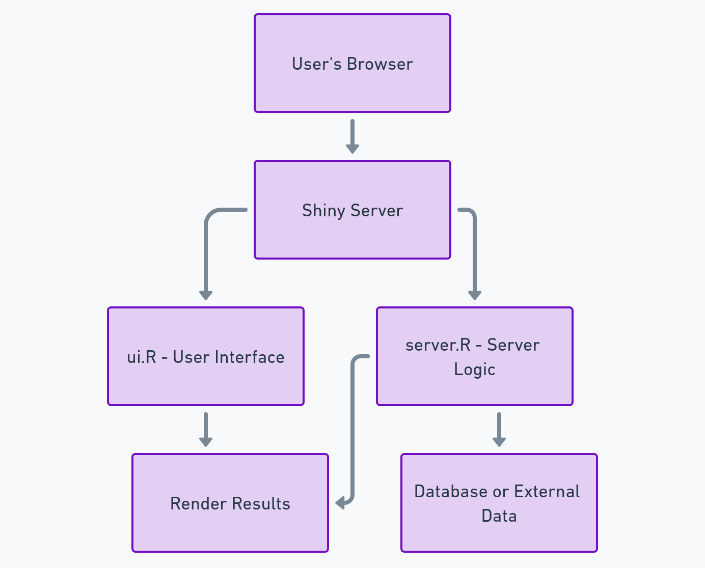

# Shiny and Jupyter Project in Docker

This project uses Docker to deploy a Shiny app and Jupyter Notebook environment. It requires Docker and Docker Compose to be installed on your system. Below are instructions for installing Docker on macOS and launching the application using Docker Compose.

## Requirements

- **Docker**: Docker is required to build and run the containerized environment.
- **Docker Compose**: Docker Compose is used to manage multiple services within the Docker container.

### Installing Docker on macOS

To install Docker on macOS using Homebrew, run:

```bash
brew install --cask docker-compose
```

Once installed, open the Docker application to start the Docker daemon.

### Folder Structure

The project follows this folder structure:

project-root/
├── data/                      # Raw GIS data and processed files
│   ├── raw/                   # Original GIS files (e.g., shapefiles)
│   └── processed/             # Cleaned and transformed data files
├── scripts/                   # R scripts for data processing, analysis, etc.
│   ├── data_preprocessing.R   # Preprocessing steps for GIS data
│   └── analysis.R             # Analysis and visualization scripts
├── shiny_app/                 # Shiny app directory
│   ├── ui.R                   # UI component of the Shiny app
│   ├── server.R               # Server logic for the Shiny app
│   └── www/                   # Assets (CSS, JavaScript, images)
├── notebooks/                 # Jupyter notebooks for exploratory work
│   └── example_notebook.ipynb # Example notebook in R
├── docker/                    # Docker configuration
│   ├── Dockerfile             # Dockerfile to set up the environment
│   └── docker-compose.yml     # Compose file for easier container management
├── .env                       # Environment variables
├── .gitignore                 # Git ignore file
└── README.md                  # Project overview and instructions


### Launching the Project

To start both the Shiny app and Jupyter Notebook, use Docker Compose. This will build and launch the services specified in docker-compose.yml.

### Command to Launch
From the project root directory, run:

```
docker-compose up --build
```

This command will:

Build the Docker image and install all necessary dependencies.
Start Shiny Server on port localhost:3838.
Start Jupyter Notebook on port localhost:8888.

### Stopping the Project
To stop the running containers, use:

docker-compose down
Links to Services

Shiny Server: http://localhost:3838
Jupyter Notebook: http://localhost:8888

### Shiny App setup



### Notes

Jupyter Notebook authentication is disabled for easy access.
Modify shiny-server.conf in docker/ if you need to customize the Shiny app settings.
This setup provides a convenient environment for developing and running both Shiny applications and Jupyter notebooks with GIS and data science capabilities.


